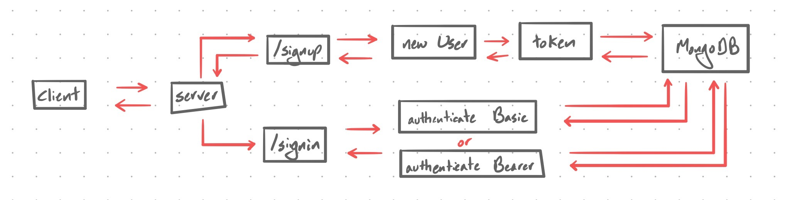

 LAB 13
=================================================

## Bearer Authentication

### Author: Jagdeep Singh

### Links and Resources
* [submission PR](https://github.com/401-advanced-javascript-js/lab-13-bearer-auth/pull/1)
* [travis](https://www.travis-ci.com/401-advanced-javascript-js/lab-13-bearer-auth)
* [back-end](http://lab-13-bearer-js.herokuapp.com/)
<!-- * [front-end](http://xyz.com) (when applicable) -->

<!-- #### Documentation -->
<!-- * [api docs](http://xyz.com) (API servers)
* [jsdoc](http://xyz.com) (Server assignments) -->

<!-- ### Modules
#### `modulename.js`
##### Exported Values and Methods

###### `foo(thing) -> string`
Usage Notes or examples

###### `bar(array) -> array`
Usage Notes or examples -->

### Setup
#### `.env` requirements
* `PORT` - Port Number
* `MONGODB_URI` - URL to the running mongo instance/db
* `SECRET` - Random string
* `GOOGLE_CLIENT_ID` - Client id for google application
* `GOOGLE_CLIENT_SECRET` - Client secret for google application
* `API_URL` - URL to running server

#### Running the app
* `npm start`
  
#### Tests
* How do you run tests?

    `npm test`

<!-- * What assertions were made?
* What assertions need to be / should be made? -->

#### UML

